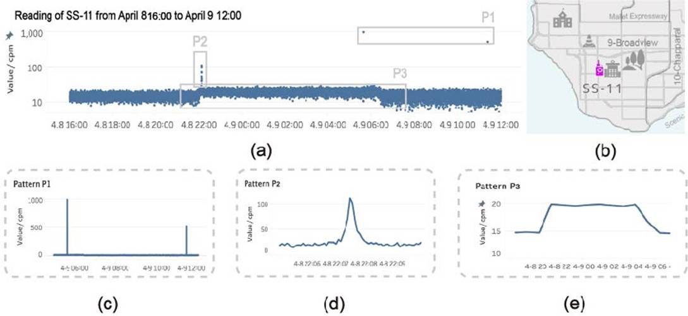
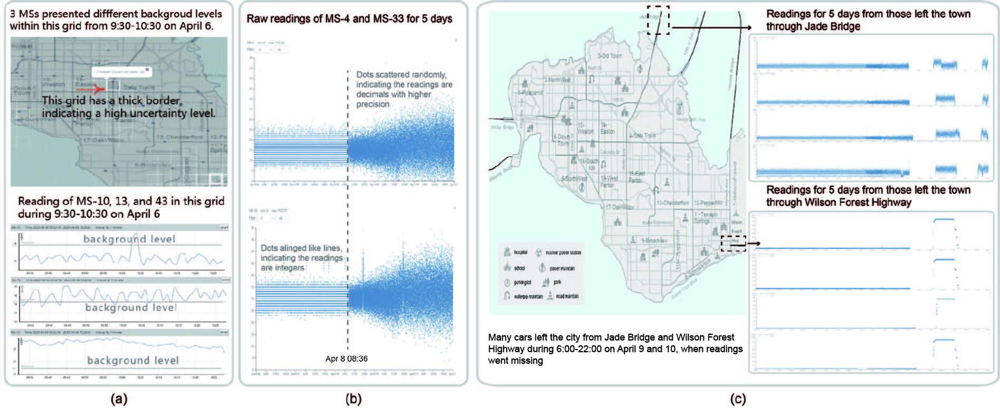

<html xmlns:v="urn:schemas-microsoft-com:vml"
xmlns:o="urn:schemas-microsoft-com:office:office"
xmlns:w="urn:schemas-microsoft-com:office:word"
xmlns:m="http://schemas.microsoft.com/office/2004/12/omml"
xmlns="http://www.w3.org/TR/REC-html40">

<head>
<meta http-equiv=Content-Type content="text/html; charset=windows-1252">
<meta name=ProgId content=Word.Document>
<meta name=Generator content="Microsoft Word 15">
<meta name=Originator content="Microsoft Word 15">
<link rel=File-List href="index.files/filelist.xml">
<link rel=Edit-Time-Data href="index.files/editdata.mso">
<!--[if !mso]>

<![endif]-->
<title>This form is a web page which was created in MS WORD and therefore can
be easily edited that way</title>
<!--[if gte mso 9]><xml>
 <o:DocumentProperties>
  <o:Author>Whiting, Mark A</o:Author>
  <o:Template>Normal</o:Template>
  <o:LastAuthor>&#36213;&#39062;</o:LastAuthor>
  <o:Revision>7</o:Revision>
  <o:TotalTime>3990</o:TotalTime>
  <o:Created>2019-07-13T04:56:00Z</o:Created>
  <o:LastSaved>2019-07-13T05:18:00Z</o:LastSaved>
  <o:Pages>1</o:Pages>
  <o:Words>3727</o:Words>
  <o:Characters>21245</o:Characters>
  <o:Company>Pacific Northwest Versions panel</o:Company>
  <o:Lines>177</o:Lines>
  <o:Paragraphs>49</o:Paragraphs>
  <o:CharactersWithSpaces>24923</o:CharactersWithSpaces>
  <o:Version>16.00</o:Version>
 </o:DocumentProperties>
 <o:OfficeDocumentSettings>
  <o:PixelsPerInch>120</o:PixelsPerInch>
 </o:OfficeDocumentSettings>
</xml><![endif]-->
<link rel=dataStoreItem href="index.files/item0059.xml"
target="index.files/props060.xml">
<link rel=themeData href="index.files/themedata.thmx">
<link rel=colorSchemeMapping href="index.files/colorschememapping.xml">
<!--[if gte mso 9]><xml>
 <w:WordDocument>
  <w:Zoom>96</w:Zoom>
  <w:TrackMoves>false</w:TrackMoves>
  <w:TrackFormatting/>
  <w:ValidateAgainstSchemas/>
  <w:SaveIfXMLInvalid>false</w:SaveIfXMLInvalid>
  <w:IgnoreMixedContent>false</w:IgnoreMixedContent>
  <w:AlwaysShowPlaceholderText>false</w:AlwaysShowPlaceholderText>
  <w:DoNotPromoteQF/>
  <w:LidThemeOther>EN-US</w:LidThemeOther>
  <w:LidThemeAsian>ZH-CN</w:LidThemeAsian>
  <w:LidThemeComplexScript>X-NONE</w:LidThemeComplexScript>
  <w:Compatibility>
   <w:BreakWrappedTables/>
   <w:SnapToGridInCell/>
   <w:WrapTextWithPunct/>
   <w:UseAsianBreakRules/>
   <w:DontGrowAutofit/>
   <w:SplitPgBreakAndParaMark/>
   <w:DontVertAlignCellWithSp/>
   <w:DontBreakConstrainedForcedTables/>
   <w:DontVertAlignInTxbx/>
   <w:Word11KerningPairs/>
   <w:CachedColBalance/>
   <w:UseFELayout/>
  </w:Compatibility>
  <w:BrowserLevel>MicrosoftInternetExplorer4</w:BrowserLevel>
  <m:mathPr>
   <m:mathFont m:val="Cambria Math"/>
   <m:brkBin m:val="before"/>
   <m:brkBinSub m:val="&#45;-"/>
   <m:smallFrac m:val="off"/>
   <m:dispDef/>
   <m:lMargin m:val="0"/>
   <m:rMargin m:val="0"/>
   <m:defJc m:val="centerGroup"/>
   <m:wrapIndent m:val="1440"/>
   <m:intLim m:val="subSup"/>
   <m:naryLim m:val="undOvr"/>
  </m:mathPr></w:WordDocument>
</xml><![endif]--><!--[if gte mso 9]><xml>
 <w:LatentStyles DefLockedState="false" DefUnhideWhenUsed="false"
  DefSemiHidden="false" DefQFormat="false" DefPriority="99"
  LatentStyleCount="376">
  <w:LsdException Locked="false" Priority="0" QFormat="true" Name="Normal"/>
  <w:LsdException Locked="false" Priority="9" QFormat="true" Name="heading 1"/>
  <w:LsdException Locked="false" Priority="9" QFormat="true" Name="heading 2"/>
  <w:LsdException Locked="false" Priority="9" QFormat="true" Name="heading 3"/>
  <w:LsdException Locked="false" Priority="9" SemiHidden="true"
   UnhideWhenUsed="true" QFormat="true" Name="heading 4"/>
  <w:LsdException Locked="false" Priority="9" SemiHidden="true"
   UnhideWhenUsed="true" QFormat="true" Name="heading 5"/>
  <w:LsdException Locked="false" Priority="9" SemiHidden="true"
   UnhideWhenUsed="true" QFormat="true" Name="heading 6"/>
  <w:LsdException Locked="false" Priority="9" SemiHidden="true"
   UnhideWhenUsed="true" QFormat="true" Name="heading 7"/>
  <w:LsdException Locked="false" Priority="9" SemiHidden="true"
   UnhideWhenUsed="true" QFormat="true" Name="heading 8"/>
  <w:LsdException Locked="false" Priority="9" SemiHidden="true"
   UnhideWhenUsed="true" QFormat="true" Name="heading 9"/>
  <w:LsdException Locked="false" SemiHidden="true" UnhideWhenUsed="true"
   Name="index 1"/>
  <w:LsdException Locked="false" SemiHidden="true" UnhideWhenUsed="true"
   Name="index 2"/>
  <w:LsdException Locked="false" SemiHidden="true" UnhideWhenUsed="true"
   Name="index 3"/>
  <w:LsdException Locked="false" SemiHidden="true" UnhideWhenUsed="true"
   Name="index 4"/>
  <w:LsdException Locked="false" SemiHidden="true" UnhideWhenUsed="true"
   Name="index 5"/>
  <w:LsdException Locked="false" SemiHidden="true" UnhideWhenUsed="true"
   Name="index 6"/>
  <w:LsdException Locked="false" SemiHidden="true" UnhideWhenUsed="true"
   Name="index 7"/>
  <w:LsdException Locked="false" SemiHidden="true" UnhideWhenUsed="true"
   Name="index 8"/>
  <w:LsdException Locked="false" SemiHidden="true" UnhideWhenUsed="true"
   Name="index 9"/>
  <w:LsdException Locked="false" Priority="39" SemiHidden="true"
   UnhideWhenUsed="true" Name="toc 1"/>
  <w:LsdException Locked="false" Priority="39" SemiHidden="true"
   UnhideWhenUsed="true" Name="toc 2"/>
  <w:LsdException Locked="false" Priority="39" SemiHidden="true"
   UnhideWhenUsed="true" Name="toc 3"/>
  <w:LsdException Locked="false" Priority="39" SemiHidden="true"
   UnhideWhenUsed="true" Name="toc 4"/>
  <w:LsdException Locked="false" Priority="39" SemiHidden="true"
   UnhideWhenUsed="true" Name="toc 5"/>
  <w:LsdException Locked="false" Priority="39" SemiHidden="true"
   UnhideWhenUsed="true" Name="toc 6"/>
  <w:LsdException Locked="false" Priority="39" SemiHidden="true"
   UnhideWhenUsed="true" Name="toc 7"/>
  <w:LsdException Locked="false" Priority="39" SemiHidden="true"
   UnhideWhenUsed="true" Name="toc 8"/>
  <w:LsdException Locked="false" Priority="39" SemiHidden="true"
   UnhideWhenUsed="true" Name="toc 9"/>
  <w:LsdException Locked="false" SemiHidden="true" UnhideWhenUsed="true"
   Name="Normal Indent"/>
  <w:LsdException Locked="false" SemiHidden="true" UnhideWhenUsed="true"
   Name="footnote text"/>
  <w:LsdException Locked="false" SemiHidden="true" UnhideWhenUsed="true"
   Name="annotation text"/>
  <w:LsdException Locked="false" SemiHidden="true" UnhideWhenUsed="true"
   Name="header"/>
  <w:LsdException Locked="false" SemiHidden="true" UnhideWhenUsed="true"
   Name="footer"/>
  <w:LsdException Locked="false" SemiHidden="true" UnhideWhenUsed="true"
   Name="index heading"/>
  <w:LsdException Locked="false" Priority="35" SemiHidden="true"
   UnhideWhenUsed="true" QFormat="true" Name="caption"/>
  <w:LsdException Locked="false" SemiHidden="true" UnhideWhenUsed="true"
   Name="table of figures"/>
  <w:LsdException Locked="false" SemiHidden="true" UnhideWhenUsed="true"
   Name="envelope address"/>
  <w:LsdException Locked="false" SemiHidden="true" UnhideWhenUsed="true"
   Name="envelope return"/>
  <w:LsdException Locked="false" SemiHidden="true" UnhideWhenUsed="true"
   Name="footnote reference"/>
  <w:LsdException Locked="false" SemiHidden="true" UnhideWhenUsed="true"
   Name="annotation reference"/>
  <w:LsdException Locked="false" SemiHidden="true" UnhideWhenUsed="true"
   Name="line number"/>
  <w:LsdException Locked="false" SemiHidden="true" UnhideWhenUsed="true"
   Name="page number"/>
  <w:LsdException Locked="false" SemiHidden="true" UnhideWhenUsed="true"
   Name="endnote reference"/>
  <w:LsdException Locked="false" SemiHidden="true" UnhideWhenUsed="true"
   Name="endnote text"/>
  <w:LsdException Locked="false" SemiHidden="true" UnhideWhenUsed="true"
   Name="table of authorities"/>
  <w:LsdException Locked="false" SemiHidden="true" UnhideWhenUsed="true"
   Name="macro"/>
  <w:LsdException Locked="false" SemiHidden="true" UnhideWhenUsed="true"
   Name="toa heading"/>
  <w:LsdException Locked="false" SemiHidden="true" UnhideWhenUsed="true"
   Name="List"/>
  <w:LsdException Locked="false" SemiHidden="true" UnhideWhenUsed="true"
   Name="List Bullet"/>
  <w:LsdException Locked="false" SemiHidden="true" UnhideWhenUsed="true"
   Name="List Number"/>
  <w:LsdException Locked="false" SemiHidden="true" UnhideWhenUsed="true"
   Name="List 2"/>
  <w:LsdException Locked="false" SemiHidden="true" UnhideWhenUsed="true"
   Name="List 3"/>
  <w:LsdException Locked="false" SemiHidden="true" UnhideWhenUsed="true"
   Name="List 4"/>
  <w:LsdException Locked="false" SemiHidden="true" UnhideWhenUsed="true"
   Name="List 5"/>
  <w:LsdException Locked="false" SemiHidden="true" UnhideWhenUsed="true"
   Name="List Bullet 2"/>
  <w:LsdException Locked="false" SemiHidden="true" UnhideWhenUsed="true"
   Name="List Bullet 3"/>
  <w:LsdException Locked="false" SemiHidden="true" UnhideWhenUsed="true"
   Name="List Bullet 4"/>
  <w:LsdException Locked="false" SemiHidden="true" UnhideWhenUsed="true"
   Name="List Bullet 5"/>
  <w:LsdException Locked="false" SemiHidden="true" UnhideWhenUsed="true"
   Name="List Number 2"/>
  <w:LsdException Locked="false" SemiHidden="true" UnhideWhenUsed="true"
   Name="List Number 3"/>
  <w:LsdException Locked="false" SemiHidden="true" UnhideWhenUsed="true"
   Name="List Number 4"/>
  <w:LsdException Locked="false" SemiHidden="true" UnhideWhenUsed="true"
   Name="List Number 5"/>
  <w:LsdException Locked="false" Priority="10" QFormat="true" Name="Title"/>
  <w:LsdException Locked="false" SemiHidden="true" UnhideWhenUsed="true"
   Name="Closing"/>
  <w:LsdException Locked="false" SemiHidden="true" UnhideWhenUsed="true"
   Name="Signature"/>
  <w:LsdException Locked="false" Priority="1" SemiHidden="true"
   UnhideWhenUsed="true" Name="Default Paragraph Font"/>
  <w:LsdException Locked="false" SemiHidden="true" UnhideWhenUsed="true"
   Name="Body Text"/>
  <w:LsdException Locked="false" SemiHidden="true" UnhideWhenUsed="true"
   Name="Body Text Indent"/>
  <w:LsdException Locked="false" SemiHidden="true" UnhideWhenUsed="true"
   Name="List Continue"/>
  <w:LsdException Locked="false" SemiHidden="true" UnhideWhenUsed="true"
   Name="List Continue 2"/>
  <w:LsdException Locked="false" SemiHidden="true" UnhideWhenUsed="true"
   Name="List Continue 3"/>
  <w:LsdException Locked="false" SemiHidden="true" UnhideWhenUsed="true"
   Name="List Continue 4"/>
  <w:LsdException Locked="false" SemiHidden="true" UnhideWhenUsed="true"
   Name="List Continue 5"/>
  <w:LsdException Locked="false" SemiHidden="true" UnhideWhenUsed="true"
   Name="Message Header"/>
  <w:LsdException Locked="false" Priority="11" QFormat="true" Name="Subtitle"/>
  <w:LsdException Locked="false" SemiHidden="true" UnhideWhenUsed="true"
   Name="Salutation"/>
  <w:LsdException Locked="false" SemiHidden="true" UnhideWhenUsed="true"
   Name="Date"/>
  <w:LsdException Locked="false" SemiHidden="true" UnhideWhenUsed="true"
   Name="Body Text First Indent"/>
  <w:LsdException Locked="false" SemiHidden="true" UnhideWhenUsed="true"
   Name="Body Text First Indent 2"/>
  <w:LsdException Locked="false" SemiHidden="true" UnhideWhenUsed="true"
   Name="Note Heading"/>
  <w:LsdException Locked="false" SemiHidden="true" UnhideWhenUsed="true"
   Name="Body Text 2"/>
  <w:LsdException Locked="false" SemiHidden="true" UnhideWhenUsed="true"
   Name="Body Text 3"/>
  <w:LsdException Locked="false" SemiHidden="true" UnhideWhenUsed="true"
   Name="Body Text Indent 2"/>
  <w:LsdException Locked="false" SemiHidden="true" UnhideWhenUsed="true"
   Name="Body Text Indent 3"/>
  <w:LsdException Locked="false" SemiHidden="true" UnhideWhenUsed="true"
   Name="Block Text"/>
  <w:LsdException Locked="false" SemiHidden="true" UnhideWhenUsed="true"
   Name="Hyperlink"/>
  <w:LsdException Locked="false" SemiHidden="true" UnhideWhenUsed="true"
   Name="FollowedHyperlink"/>
  <w:LsdException Locked="false" Priority="22" QFormat="true" Name="Strong"/>
  <w:LsdException Locked="false" Priority="20" QFormat="true" Name="Emphasis"/>
  <w:LsdException Locked="false" SemiHidden="true" UnhideWhenUsed="true"
   Name="Document Map"/>
  <w:LsdException Locked="false" SemiHidden="true" UnhideWhenUsed="true"
   Name="Plain Text"/>
  <w:LsdException Locked="false" SemiHidden="true" UnhideWhenUsed="true"
   Name="E-mail Signature"/>
  <w:LsdException Locked="false" SemiHidden="true" UnhideWhenUsed="true"
   Name="HTML Top of Form"/>
  <w:LsdException Locked="false" SemiHidden="true" UnhideWhenUsed="true"
   Name="HTML Bottom of Form"/>
  <w:LsdException Locked="false" SemiHidden="true" UnhideWhenUsed="true"
   Name="Normal (Web)"/>
  <w:LsdException Locked="false" SemiHidden="true" UnhideWhenUsed="true"
   Name="HTML Acronym"/>
  <w:LsdException Locked="false" SemiHidden="true" UnhideWhenUsed="true"
   Name="HTML Address"/>
  <w:LsdException Locked="false" SemiHidden="true" UnhideWhenUsed="true"
   Name="HTML Cite"/>
  <w:LsdException Locked="false" SemiHidden="true" UnhideWhenUsed="true"
   Name="HTML Code"/>
  <w:LsdException Locked="false" SemiHidden="true" UnhideWhenUsed="true"
   Name="HTML Definition"/>
  <w:LsdException Locked="false" SemiHidden="true" UnhideWhenUsed="true"
   Name="HTML Keyboard"/>
  <w:LsdException Locked="false" SemiHidden="true" UnhideWhenUsed="true"
   Name="HTML Preformatted"/>
  <w:LsdException Locked="false" SemiHidden="true" UnhideWhenUsed="true"
   Name="HTML Sample"/>
  <w:LsdException Locked="false" SemiHidden="true" UnhideWhenUsed="true"
   Name="HTML Typewriter"/>
  <w:LsdException Locked="false" SemiHidden="true" UnhideWhenUsed="true"
   Name="HTML Variable"/>
  <w:LsdException Locked="false" SemiHidden="true" UnhideWhenUsed="true"
   Name="Normal Table"/>
  <w:LsdException Locked="false" SemiHidden="true" UnhideWhenUsed="true"
   Name="annotation subject"/>
  <w:LsdException Locked="false" SemiHidden="true" UnhideWhenUsed="true"
   Name="No List"/>
  <w:LsdException Locked="false" SemiHidden="true" UnhideWhenUsed="true"
   Name="Outline List 1"/>
  <w:LsdException Locked="false" SemiHidden="true" UnhideWhenUsed="true"
   Name="Outline List 2"/>
  <w:LsdException Locked="false" SemiHidden="true" UnhideWhenUsed="true"
   Name="Outline List 3"/>
  <w:LsdException Locked="false" SemiHidden="true" UnhideWhenUsed="true"
   Name="Table Simple 1"/>
  <w:LsdException Locked="false" SemiHidden="true" UnhideWhenUsed="true"
   Name="Table Simple 2"/>
  <w:LsdException Locked="false" SemiHidden="true" UnhideWhenUsed="true"
   Name="Table Simple 3"/>
  <w:LsdException Locked="false" SemiHidden="true" UnhideWhenUsed="true"
   Name="Table Classic 1"/>
  <w:LsdException Locked="false" SemiHidden="true" UnhideWhenUsed="true"
   Name="Table Classic 2"/>
  <w:LsdException Locked="false" SemiHidden="true" UnhideWhenUsed="true"
   Name="Table Classic 3"/>
  <w:LsdException Locked="false" SemiHidden="true" UnhideWhenUsed="true"
   Name="Table Classic 4"/>
  <w:LsdException Locked="false" SemiHidden="true" UnhideWhenUsed="true"
   Name="Table Colorful 1"/>
  <w:LsdException Locked="false" SemiHidden="true" UnhideWhenUsed="true"
   Name="Table Colorful 2"/>
  <w:LsdException Locked="false" SemiHidden="true" UnhideWhenUsed="true"
   Name="Table Colorful 3"/>
  <w:LsdException Locked="false" SemiHidden="true" UnhideWhenUsed="true"
   Name="Table Columns 1"/>
  <w:LsdException Locked="false" SemiHidden="true" UnhideWhenUsed="true"
   Name="Table Columns 2"/>
  <w:LsdException Locked="false" SemiHidden="true" UnhideWhenUsed="true"
   Name="Table Columns 3"/>
  <w:LsdException Locked="false" SemiHidden="true" UnhideWhenUsed="true"
   Name="Table Columns 4"/>
  <w:LsdException Locked="false" SemiHidden="true" UnhideWhenUsed="true"
   Name="Table Columns 5"/>
  <w:LsdException Locked="false" SemiHidden="true" UnhideWhenUsed="true"
   Name="Table Grid 1"/>
  <w:LsdException Locked="false" SemiHidden="true" UnhideWhenUsed="true"
   Name="Table Grid 2"/>
  <w:LsdException Locked="false" SemiHidden="true" UnhideWhenUsed="true"
   Name="Table Grid 3"/>
  <w:LsdException Locked="false" SemiHidden="true" UnhideWhenUsed="true"
   Name="Table Grid 4"/>
  <w:LsdException Locked="false" SemiHidden="true" UnhideWhenUsed="true"
   Name="Table Grid 5"/>
  <w:LsdException Locked="false" SemiHidden="true" UnhideWhenUsed="true"
   Name="Table Grid 6"/>
  <w:LsdException Locked="false" SemiHidden="true" UnhideWhenUsed="true"
   Name="Table Grid 7"/>
  <w:LsdException Locked="false" SemiHidden="true" UnhideWhenUsed="true"
   Name="Table Grid 8"/>
  <w:LsdException Locked="false" SemiHidden="true" UnhideWhenUsed="true"
   Name="Table List 1"/>
  <w:LsdException Locked="false" SemiHidden="true" UnhideWhenUsed="true"
   Name="Table List 2"/>
  <w:LsdException Locked="false" SemiHidden="true" UnhideWhenUsed="true"
   Name="Table List 3"/>
  <w:LsdException Locked="false" SemiHidden="true" UnhideWhenUsed="true"
   Name="Table List 4"/>
  <w:LsdException Locked="false" SemiHidden="true" UnhideWhenUsed="true"
   Name="Table List 5"/>
  <w:LsdException Locked="false" SemiHidden="true" UnhideWhenUsed="true"
   Name="Table List 6"/>
  <w:LsdException Locked="false" SemiHidden="true" UnhideWhenUsed="true"
   Name="Table List 7"/>
  <w:LsdException Locked="false" SemiHidden="true" UnhideWhenUsed="true"
   Name="Table List 8"/>
  <w:LsdException Locked="false" SemiHidden="true" UnhideWhenUsed="true"
   Name="Table 3D effects 1"/>
  <w:LsdException Locked="false" SemiHidden="true" UnhideWhenUsed="true"
   Name="Table 3D effects 2"/>
  <w:LsdException Locked="false" SemiHidden="true" UnhideWhenUsed="true"
   Name="Table 3D effects 3"/>
  <w:LsdException Locked="false" SemiHidden="true" UnhideWhenUsed="true"
   Name="Table Contemporary"/>
  <w:LsdException Locked="false" SemiHidden="true" UnhideWhenUsed="true"
   Name="Table Elegant"/>
  <w:LsdException Locked="false" SemiHidden="true" UnhideWhenUsed="true"
   Name="Table Professional"/>
  <w:LsdException Locked="false" SemiHidden="true" UnhideWhenUsed="true"
   Name="Table Subtle 1"/>
  <w:LsdException Locked="false" SemiHidden="true" UnhideWhenUsed="true"
   Name="Table Subtle 2"/>
  <w:LsdException Locked="false" SemiHidden="true" UnhideWhenUsed="true"
   Name="Table Web 1"/>
  <w:LsdException Locked="false" SemiHidden="true" UnhideWhenUsed="true"
   Name="Table Web 2"/>
  <w:LsdException Locked="false" SemiHidden="true" UnhideWhenUsed="true"
   Name="Table Web 3"/>
  <w:LsdException Locked="false" SemiHidden="true" UnhideWhenUsed="true"
   Name="Balloon Text"/>
  <w:LsdException Locked="false" Priority="59" Name="Table Grid"/>
  <w:LsdException Locked="false" SemiHidden="true" UnhideWhenUsed="true"
   Name="Table Theme"/>
  <w:LsdException Locked="false" SemiHidden="true" Name="Placeholder Text"/>
  <w:LsdException Locked="false" Priority="1" QFormat="true" Name="No Spacing"/>
  <w:LsdException Locked="false" Priority="60" Name="Light Shading"/>
  <w:LsdException Locked="false" Priority="61" Name="Light List"/>
  <w:LsdException Locked="false" Priority="62" Name="Light Grid"/>
  <w:LsdException Locked="false" Priority="63" Name="Medium Shading 1"/>
  <w:LsdException Locked="false" Priority="64" Name="Medium Shading 2"/>
  <w:LsdException Locked="false" Priority="65" Name="Medium List 1"/>
  <w:LsdException Locked="false" Priority="66" Name="Medium List 2"/>
  <w:LsdException Locked="false" Priority="67" Name="Medium Grid 1"/>
  <w:LsdException Locked="false" Priority="68" Name="Medium Grid 2"/>
  <w:LsdException Locked="false" Priority="69" Name="Medium Grid 3"/>
  <w:LsdException Locked="false" Priority="70" Name="Dark List"/>
  <w:LsdException Locked="false" Priority="71" Name="Colorful Shading"/>
  <w:LsdException Locked="false" Priority="72" Name="Colorful List"/>
  <w:LsdException Locked="false" Priority="73" Name="Colorful Grid"/>
  <w:LsdException Locked="false" Priority="60" Name="Light Shading Accent 1"/>
  <w:LsdException Locked="false" Priority="61" Name="Light List Accent 1"/>
  <w:LsdException Locked="false" Priority="62" Name="Light Grid Accent 1"/>
  <w:LsdException Locked="false" Priority="63" Name="Medium Shading 1 Accent 1"/>
  <w:LsdException Locked="false" Priority="64" Name="Medium Shading 2 Accent 1"/>
  <w:LsdException Locked="false" Priority="65" Name="Medium List 1 Accent 1"/>
  <w:LsdException Locked="false" SemiHidden="true" Name="Revision"/>
  <w:LsdException Locked="false" Priority="34" QFormat="true"
   Name="List Paragraph"/>
  <w:LsdException Locked="false" Priority="29" QFormat="true" Name="Quote"/>
  <w:LsdException Locked="false" Priority="30" QFormat="true"
   Name="Intense Quote"/>
  <w:LsdException Locked="false" Priority="66" Name="Medium List 2 Accent 1"/>
  <w:LsdException Locked="false" Priority="67" Name="Medium Grid 1 Accent 1"/>
  <w:LsdException Locked="false" Priority="68" Name="Medium Grid 2 Accent 1"/>
  <w:LsdException Locked="false" Priority="69" Name="Medium Grid 3 Accent 1"/>
  <w:LsdException Locked="false" Priority="70" Name="Dark List Accent 1"/>
  <w:LsdException Locked="false" Priority="71" Name="Colorful Shading Accent 1"/>
  <w:LsdException Locked="false" Priority="72" Name="Colorful List Accent 1"/>
  <w:LsdException Locked="false" Priority="73" Name="Colorful Grid Accent 1"/>
  <w:LsdException Locked="false" Priority="60" Name="Light Shading Accent 2"/>
  <w:LsdException Locked="false" Priority="61" Name="Light List Accent 2"/>
  <w:LsdException Locked="false" Priority="62" Name="Light Grid Accent 2"/>
  <w:LsdException Locked="false" Priority="63" Name="Medium Shading 1 Accent 2"/>
  <w:LsdException Locked="false" Priority="64" Name="Medium Shading 2 Accent 2"/>
  <w:LsdException Locked="false" Priority="65" Name="Medium List 1 Accent 2"/>
  <w:LsdException Locked="false" Priority="66" Name="Medium List 2 Accent 2"/>
  <w:LsdException Locked="false" Priority="67" Name="Medium Grid 1 Accent 2"/>
  <w:LsdException Locked="false" Priority="68" Name="Medium Grid 2 Accent 2"/>
  <w:LsdException Locked="false" Priority="69" Name="Medium Grid 3 Accent 2"/>
  <w:LsdException Locked="false" Priority="70" Name="Dark List Accent 2"/>
  <w:LsdException Locked="false" Priority="71" Name="Colorful Shading Accent 2"/>
  <w:LsdException Locked="false" Priority="72" Name="Colorful List Accent 2"/>
  <w:LsdException Locked="false" Priority="73" Name="Colorful Grid Accent 2"/>
  <w:LsdException Locked="false" Priority="60" Name="Light Shading Accent 3"/>
  <w:LsdException Locked="false" Priority="61" Name="Light List Accent 3"/>
  <w:LsdException Locked="false" Priority="62" Name="Light Grid Accent 3"/>
  <w:LsdException Locked="false" Priority="63" Name="Medium Shading 1 Accent 3"/>
  <w:LsdException Locked="false" Priority="64" Name="Medium Shading 2 Accent 3"/>
  <w:LsdException Locked="false" Priority="65" Name="Medium List 1 Accent 3"/>
  <w:LsdException Locked="false" Priority="66" Name="Medium List 2 Accent 3"/>
  <w:LsdException Locked="false" Priority="67" Name="Medium Grid 1 Accent 3"/>
  <w:LsdException Locked="false" Priority="68" Name="Medium Grid 2 Accent 3"/>
  <w:LsdException Locked="false" Priority="69" Name="Medium Grid 3 Accent 3"/>
  <w:LsdException Locked="false" Priority="70" Name="Dark List Accent 3"/>
  <w:LsdException Locked="false" Priority="71" Name="Colorful Shading Accent 3"/>
  <w:LsdException Locked="false" Priority="72" Name="Colorful List Accent 3"/>
  <w:LsdException Locked="false" Priority="73" Name="Colorful Grid Accent 3"/>
  <w:LsdException Locked="false" Priority="60" Name="Light Shading Accent 4"/>
  <w:LsdException Locked="false" Priority="61" Name="Light List Accent 4"/>
  <w:LsdException Locked="false" Priority="62" Name="Light Grid Accent 4"/>
  <w:LsdException Locked="false" Priority="63" Name="Medium Shading 1 Accent 4"/>
  <w:LsdException Locked="false" Priority="64" Name="Medium Shading 2 Accent 4"/>
  <w:LsdException Locked="false" Priority="65" Name="Medium List 1 Accent 4"/>
  <w:LsdException Locked="false" Priority="66" Name="Medium List 2 Accent 4"/>
  <w:LsdException Locked="false" Priority="67" Name="Medium Grid 1 Accent 4"/>
  <w:LsdException Locked="false" Priority="68" Name="Medium Grid 2 Accent 4"/>
  <w:LsdException Locked="false" Priority="69" Name="Medium Grid 3 Accent 4"/>
  <w:LsdException Locked="false" Priority="70" Name="Dark List Accent 4"/>
  <w:LsdException Locked="false" Priority="71" Name="Colorful Shading Accent 4"/>
  <w:LsdException Locked="false" Priority="72" Name="Colorful List Accent 4"/>
  <w:LsdException Locked="false" Priority="73" Name="Colorful Grid Accent 4"/>
  <w:LsdException Locked="false" Priority="60" Name="Light Shading Accent 5"/>
  <w:LsdException Locked="false" Priority="61" Name="Light List Accent 5"/>
  <w:LsdException Locked="false" Priority="62" Name="Light Grid Accent 5"/>
  <w:LsdException Locked="false" Priority="63" Name="Medium Shading 1 Accent 5"/>
  <w:LsdException Locked="false" Priority="64" Name="Medium Shading 2 Accent 5"/>
  <w:LsdException Locked="false" Priority="65" Name="Medium List 1 Accent 5"/>
  <w:LsdException Locked="false" Priority="66" Name="Medium List 2 Accent 5"/>
  <w:LsdException Locked="false" Priority="67" Name="Medium Grid 1 Accent 5"/>
  <w:LsdException Locked="false" Priority="68" Name="Medium Grid 2 Accent 5"/>
  <w:LsdException Locked="false" Priority="69" Name="Medium Grid 3 Accent 5"/>
  <w:LsdException Locked="false" Priority="70" Name="Dark List Accent 5"/>
  <w:LsdException Locked="false" Priority="71" Name="Colorful Shading Accent 5"/>
  <w:LsdException Locked="false" Priority="72" Name="Colorful List Accent 5"/>
  <w:LsdException Locked="false" Priority="73" Name="Colorful Grid Accent 5"/>
  <w:LsdException Locked="false" Priority="60" Name="Light Shading Accent 6"/>
  <w:LsdException Locked="false" Priority="61" Name="Light List Accent 6"/>
  <w:LsdException Locked="false" Priority="62" Name="Light Grid Accent 6"/>
  <w:LsdException Locked="false" Priority="63" Name="Medium Shading 1 Accent 6"/>
  <w:LsdException Locked="false" Priority="64" Name="Medium Shading 2 Accent 6"/>
  <w:LsdException Locked="false" Priority="65" Name="Medium List 1 Accent 6"/>
  <w:LsdException Locked="false" Priority="66" Name="Medium List 2 Accent 6"/>
  <w:LsdException Locked="false" Priority="67" Name="Medium Grid 1 Accent 6"/>
  <w:LsdException Locked="false" Priority="68" Name="Medium Grid 2 Accent 6"/>
  <w:LsdException Locked="false" Priority="69" Name="Medium Grid 3 Accent 6"/>
  <w:LsdException Locked="false" Priority="70" Name="Dark List Accent 6"/>
  <w:LsdException Locked="false" Priority="71" Name="Colorful Shading Accent 6"/>
  <w:LsdException Locked="false" Priority="72" Name="Colorful List Accent 6"/>
  <w:LsdException Locked="false" Priority="73" Name="Colorful Grid Accent 6"/>
  <w:LsdException Locked="false" Priority="19" QFormat="true"
   Name="Subtle Emphasis"/>
  <w:LsdException Locked="false" Priority="21" QFormat="true"
   Name="Intense Emphasis"/>
  <w:LsdException Locked="false" Priority="31" QFormat="true"
   Name="Subtle Reference"/>
  <w:LsdException Locked="false" Priority="32" QFormat="true"
   Name="Intense Reference"/>
  <w:LsdException Locked="false" Priority="33" QFormat="true" Name="Book Title"/>
  <w:LsdException Locked="false" Priority="37" SemiHidden="true"
   UnhideWhenUsed="true" Name="Bibliography"/>
  <w:LsdException Locked="false" Priority="39" SemiHidden="true"
   UnhideWhenUsed="true" QFormat="true" Name="TOC Heading"/>
  <w:LsdException Locked="false" Priority="41" Name="Plain Table 1"/>
  <w:LsdException Locked="false" Priority="42" Name="Plain Table 2"/>
  <w:LsdException Locked="false" Priority="43" Name="Plain Table 3"/>
  <w:LsdException Locked="false" Priority="44" Name="Plain Table 4"/>
  <w:LsdException Locked="false" Priority="45" Name="Plain Table 5"/>
  <w:LsdException Locked="false" Priority="40" Name="Grid Table Light"/>
  <w:LsdException Locked="false" Priority="46" Name="Grid Table 1 Light"/>
  <w:LsdException Locked="false" Priority="47" Name="Grid Table 2"/>
  <w:LsdException Locked="false" Priority="48" Name="Grid Table 3"/>
  <w:LsdException Locked="false" Priority="49" Name="Grid Table 4"/>
  <w:LsdException Locked="false" Priority="50" Name="Grid Table 5 Dark"/>
  <w:LsdException Locked="false" Priority="51" Name="Grid Table 6 Colorful"/>
  <w:LsdException Locked="false" Priority="52" Name="Grid Table 7 Colorful"/>
  <w:LsdException Locked="false" Priority="46"
   Name="Grid Table 1 Light Accent 1"/>
  <w:LsdException Locked="false" Priority="47" Name="Grid Table 2 Accent 1"/>
  <w:LsdException Locked="false" Priority="48" Name="Grid Table 3 Accent 1"/>
  <w:LsdException Locked="false" Priority="49" Name="Grid Table 4 Accent 1"/>
  <w:LsdException Locked="false" Priority="50" Name="Grid Table 5 Dark Accent 1"/>
  <w:LsdException Locked="false" Priority="51"
   Name="Grid Table 6 Colorful Accent 1"/>
  <w:LsdException Locked="false" Priority="52"
   Name="Grid Table 7 Colorful Accent 1"/>
  <w:LsdException Locked="false" Priority="46"
   Name="Grid Table 1 Light Accent 2"/>
  <w:LsdException Locked="false" Priority="47" Name="Grid Table 2 Accent 2"/>
  <w:LsdException Locked="false" Priority="48" Name="Grid Table 3 Accent 2"/>
  <w:LsdException Locked="false" Priority="49" Name="Grid Table 4 Accent 2"/>
  <w:LsdException Locked="false" Priority="50" Name="Grid Table 5 Dark Accent 2"/>
  <w:LsdException Locked="false" Priority="51"
   Name="Grid Table 6 Colorful Accent 2"/>
  <w:LsdException Locked="false" Priority="52"
   Name="Grid Table 7 Colorful Accent 2"/>
  <w:LsdException Locked="false" Priority="46"
   Name="Grid Table 1 Light Accent 3"/>
  <w:LsdException Locked="false" Priority="47" Name="Grid Table 2 Accent 3"/>
  <w:LsdException Locked="false" Priority="48" Name="Grid Table 3 Accent 3"/>
  <w:LsdException Locked="false" Priority="49" Name="Grid Table 4 Accent 3"/>
  <w:LsdException Locked="false" Priority="50" Name="Grid Table 5 Dark Accent 3"/>
  <w:LsdException Locked="false" Priority="51"
   Name="Grid Table 6 Colorful Accent 3"/>
  <w:LsdException Locked="false" Priority="52"
   Name="Grid Table 7 Colorful Accent 3"/>
  <w:LsdException Locked="false" Priority="46"
   Name="Grid Table 1 Light Accent 4"/>
  <w:LsdException Locked="false" Priority="47" Name="Grid Table 2 Accent 4"/>
  <w:LsdException Locked="false" Priority="48" Name="Grid Table 3 Accent 4"/>
  <w:LsdException Locked="false" Priority="49" Name="Grid Table 4 Accent 4"/>
  <w:LsdException Locked="false" Priority="50" Name="Grid Table 5 Dark Accent 4"/>
  <w:LsdException Locked="false" Priority="51"
   Name="Grid Table 6 Colorful Accent 4"/>
  <w:LsdException Locked="false" Priority="52"
   Name="Grid Table 7 Colorful Accent 4"/>
  <w:LsdException Locked="false" Priority="46"
   Name="Grid Table 1 Light Accent 5"/>
  <w:LsdException Locked="false" Priority="47" Name="Grid Table 2 Accent 5"/>
  <w:LsdException Locked="false" Priority="48" Name="Grid Table 3 Accent 5"/>
  <w:LsdException Locked="false" Priority="49" Name="Grid Table 4 Accent 5"/>
  <w:LsdException Locked="false" Priority="50" Name="Grid Table 5 Dark Accent 5"/>
  <w:LsdException Locked="false" Priority="51"
   Name="Grid Table 6 Colorful Accent 5"/>
  <w:LsdException Locked="false" Priority="52"
   Name="Grid Table 7 Colorful Accent 5"/>
  <w:LsdException Locked="false" Priority="46"
   Name="Grid Table 1 Light Accent 6"/>
  <w:LsdException Locked="false" Priority="47" Name="Grid Table 2 Accent 6"/>
  <w:LsdException Locked="false" Priority="48" Name="Grid Table 3 Accent 6"/>
  <w:LsdException Locked="false" Priority="49" Name="Grid Table 4 Accent 6"/>
  <w:LsdException Locked="false" Priority="50" Name="Grid Table 5 Dark Accent 6"/>
  <w:LsdException Locked="false" Priority="51"
   Name="Grid Table 6 Colorful Accent 6"/>
  <w:LsdException Locked="false" Priority="52"
   Name="Grid Table 7 Colorful Accent 6"/>
  <w:LsdException Locked="false" Priority="46" Name="List Table 1 Light"/>
  <w:LsdException Locked="false" Priority="47" Name="List Table 2"/>
  <w:LsdException Locked="false" Priority="48" Name="List Table 3"/>
  <w:LsdException Locked="false" Priority="49" Name="List Table 4"/>
  <w:LsdException Locked="false" Priority="50" Name="List Table 5 Dark"/>
  <w:LsdException Locked="false" Priority="51" Name="List Table 6 Colorful"/>
  <w:LsdException Locked="false" Priority="52" Name="List Table 7 Colorful"/>
  <w:LsdException Locked="false" Priority="46"
   Name="List Table 1 Light Accent 1"/>
  <w:LsdException Locked="false" Priority="47" Name="List Table 2 Accent 1"/>
  <w:LsdException Locked="false" Priority="48" Name="List Table 3 Accent 1"/>
  <w:LsdException Locked="false" Priority="49" Name="List Table 4 Accent 1"/>
  <w:LsdException Locked="false" Priority="50" Name="List Table 5 Dark Accent 1"/>
  <w:LsdException Locked="false" Priority="51"
   Name="List Table 6 Colorful Accent 1"/>
  <w:LsdException Locked="false" Priority="52"
   Name="List Table 7 Colorful Accent 1"/>
  <w:LsdException Locked="false" Priority="46"
   Name="List Table 1 Light Accent 2"/>
  <w:LsdException Locked="false" Priority="47" Name="List Table 2 Accent 2"/>
  <w:LsdException Locked="false" Priority="48" Name="List Table 3 Accent 2"/>
  <w:LsdException Locked="false" Priority="49" Name="List Table 4 Accent 2"/>
  <w:LsdException Locked="false" Priority="50" Name="List Table 5 Dark Accent 2"/>
  <w:LsdException Locked="false" Priority="51"
   Name="List Table 6 Colorful Accent 2"/>
  <w:LsdException Locked="false" Priority="52"
   Name="List Table 7 Colorful Accent 2"/>
  <w:LsdException Locked="false" Priority="46"
   Name="List Table 1 Light Accent 3"/>
  <w:LsdException Locked="false" Priority="47" Name="List Table 2 Accent 3"/>
  <w:LsdException Locked="false" Priority="48" Name="List Table 3 Accent 3"/>
  <w:LsdException Locked="false" Priority="49" Name="List Table 4 Accent 3"/>
  <w:LsdException Locked="false" Priority="50" Name="List Table 5 Dark Accent 3"/>
  <w:LsdException Locked="false" Priority="51"
   Name="List Table 6 Colorful Accent 3"/>
  <w:LsdException Locked="false" Priority="52"
   Name="List Table 7 Colorful Accent 3"/>
  <w:LsdException Locked="false" Priority="46"
   Name="List Table 1 Light Accent 4"/>
  <w:LsdException Locked="false" Priority="47" Name="List Table 2 Accent 4"/>
  <w:LsdException Locked="false" Priority="48" Name="List Table 3 Accent 4"/>
  <w:LsdException Locked="false" Priority="49" Name="List Table 4 Accent 4"/>
  <w:LsdException Locked="false" Priority="50" Name="List Table 5 Dark Accent 4"/>
  <w:LsdException Locked="false" Priority="51"
   Name="List Table 6 Colorful Accent 4"/>
  <w:LsdException Locked="false" Priority="52"
   Name="List Table 7 Colorful Accent 4"/>
  <w:LsdException Locked="false" Priority="46"
   Name="List Table 1 Light Accent 5"/>
  <w:LsdException Locked="false" Priority="47" Name="List Table 2 Accent 5"/>
  <w:LsdException Locked="false" Priority="48" Name="List Table 3 Accent 5"/>
  <w:LsdException Locked="false" Priority="49" Name="List Table 4 Accent 5"/>
  <w:LsdException Locked="false" Priority="50" Name="List Table 5 Dark Accent 5"/>
  <w:LsdException Locked="false" Priority="51"
   Name="List Table 6 Colorful Accent 5"/>
  <w:LsdException Locked="false" Priority="52"
   Name="List Table 7 Colorful Accent 5"/>
  <w:LsdException Locked="false" Priority="46"
   Name="List Table 1 Light Accent 6"/>
  <w:LsdException Locked="false" Priority="47" Name="List Table 2 Accent 6"/>
  <w:LsdException Locked="false" Priority="48" Name="List Table 3 Accent 6"/>
  <w:LsdException Locked="false" Priority="49" Name="List Table 4 Accent 6"/>
  <w:LsdException Locked="false" Priority="50" Name="List Table 5 Dark Accent 6"/>
  <w:LsdException Locked="false" Priority="51"
   Name="List Table 6 Colorful Accent 6"/>
  <w:LsdException Locked="false" Priority="52"
   Name="List Table 7 Colorful Accent 6"/>
  <w:LsdException Locked="false" SemiHidden="true" UnhideWhenUsed="true"
   Name="Mention"/>
  <w:LsdException Locked="false" SemiHidden="true" UnhideWhenUsed="true"
   Name="Smart Hyperlink"/>
  <w:LsdException Locked="false" SemiHidden="true" UnhideWhenUsed="true"
   Name="Hashtag"/>
  <w:LsdException Locked="false" SemiHidden="true" UnhideWhenUsed="true"
   Name="Unresolved Mention"/>
  <w:LsdException Locked="false" SemiHidden="true" UnhideWhenUsed="true"
   Name="Smart Link"/>
 </w:LatentStyles>
</xml><![endif]-->

<!--[if gte mso 10]>

<![endif]--><!--[if gte mso 9]><xml>
 <o:shapedefaults v:ext="edit" spidmax="2049"/>
</xml><![endif]--><!--[if gte mso 9]><xml>
 <o:shapelayout v:ext="edit">
  <o:idmap v:ext="edit" data="1"/>
 </o:shapelayout></xml><![endif]-->
</head>

<body lang=ZH-CN link=blue vlink=purple style='tab-interval:36.0pt'>

<h2 align=center style='margin:0cm;margin-bottom:.0001pt;text-align:center'>Entry
Name: &quot;CSU-Jiang-MC2&quot;<o:p></o:p></h2>

<h2 align=center style='margin:0cm;margin-bottom:.0001pt;text-align:center'>VAST
Challenge 2019 
<u>Mini-Challenge 2</u><o:p></o:p></h2>

<h3 style='margin:0cm;margin-bottom:.0001pt'><o:p>&nbsp;</o:p></h3>

<h3 style='margin:0cm;margin-bottom:.0001pt'><o:p>&nbsp;</o:p></h3>

<h3 style='margin:0cm;margin-bottom:.0001pt'>Team Members:<i> 
</i></h3>

Haojin Jiang, Central South University, <a href="mailto:1316918731@qq.com">1316918731@qq.com</a> PRIMARY<o:p></o:p>

Kui Yang, Central South University, <a href="mailto:kuiyang@csu.edu.cn">kuiyang@csu.edu.cn</a> <o:p></o:p>

Yaqi Qin, Central South University, <a href="mailto:614067608@qq.com">614067608@qq.com</a> <o:p></o:p>

Yifei Yang, Central South University, <a href="mailto:3901160307@csu.edu.cn">3901160307@csu.edu.cn</a> <o:p></o:p>

Ying Zhao,
Central South University, <a href="mailto:zhaoying@csu.edu.cn">zhaoying@csu.edu.cn</a> SUPERVISOR<o:p></o:p>

Fangfang
Zhou, Central South University, <a href="mailto:zff@csu.edu.cn">zff@csu.edu.cn</a> SUPERVISOR<o:p></o:p>

<b style='mso-bidi-font-weight:normal'><o:p>&nbsp;</o:p></b>

<b style='mso-bidi-font-weight:normal'>Student Team:</b> <b style='mso-bidi-font-weight:normal'></b><i style='mso-bidi-font-style:normal'><o:p></o:p></i>

YES<o:p></o:p>

<i style='mso-bidi-font-style:normal'><o:p>&nbsp;</o:p></i>

<h3 style='margin:0cm;margin-bottom:.0001pt'>Tools Used:<o:p></o:p></h3>

D3.js<o:p></o:p>

Python<o:p></o:p>

Excel<o:p></o:p>

Tableau<o:p></o:p>

<o:p>&nbsp;</o:p>

<b style='mso-bidi-font-weight:normal'>Approximately how many
hours were spent working on this submission in total?<o:p></o:p></b>

150 hours<b style='mso-bidi-font-weight:
normal'><o:p></o:p></b>

<b style='mso-bidi-font-weight:normal'><o:p>&nbsp;</o:p></b>

<b style='mso-bidi-font-weight:normal'>May we post your
submission in the Visual Analytics Benchmark Repository after VAST Challenge
2019 is complete? <o:p></o:p></b>

YES<o:p></o:p>

<o:p>&nbsp;</o:p>

<b>Video <o:p></o:p></b>

<b style='mso-bidi-font-weight:normal'><a href="index.files/video.wmv">index.files\video.wmv</a><o:p></o:p></b>

<o:p>&nbsp;</o:p>

<b>Three high resolution figures to demonstrate how to
read our visualization design.<o:p></o:p></b>

<b style='mso-bidi-font-weight:normal'><a href="index.files/Case1.jpg">index.files\Case1.jpg</a><o:p></o:p></b>

<b style='mso-bidi-font-weight:normal'><a href="index.files/Case2.jpg">index.files\Case2.jpg</a></b><o:p></o:p>

<b style='mso-bidi-font-weight:normal'><a href="index.files/Case3.jpg">index.files\Case3.jpg</a></b><b style='mso-bidi-font-weight:normal'><o:p></o:p></b>

<o:p>&nbsp;</o:p>

<o:p>&nbsp;</o:p>

<o:p>&nbsp;</o:p>

<b
style='mso-bidi-font-weight:normal'>Questions<o:p></o:p></b>

Your task, as
supported by visual analytics that you apply, is to help St. Himark's emergency
management team combine data from the government-operated stationary monitors
with data from citizen-operated mobile sensors to help them better understand
conditions in the city and identify likely locations that will require further
monitoring, cleanup, or even evacuation. Will data from citizen scientists
clarify the situation or make it more uncertain? Use visual analytics to
develop responses to the questions below. Novel visualizations of uncertainty
are especially interesting for this mini-challenge.<o:p></o:p>

To begin with, Table.1 lists out major events that had impacts
on radiation measurements. <o:p></o:p>

Table.1 An overview of major events.<o:p></o:p>

<!--[if gte vml 1]><v:shapetype id="_x0000_t75"
 coordsize="21600,21600" o:spt="75" o:preferrelative="t" path="m@4@5l@4@11@9@11@9@5xe"
 filled="f" stroked="f">
 <v:stroke joinstyle="miter"/>
 <v:formulas>
  <v:f eqn="if lineDrawn pixelLineWidth 0"/>
  <v:f eqn="sum @0 1 0"/>
  <v:f eqn="sum 0 0 @1"/>
  <v:f eqn="prod @2 1 2"/>
  <v:f eqn="prod @3 21600 pixelWidth"/>
  <v:f eqn="prod @3 21600 pixelHeight"/>
  <v:f eqn="sum @0 0 1"/>
  <v:f eqn="prod @6 1 2"/>
  <v:f eqn="prod @7 21600 pixelWidth"/>
  <v:f eqn="sum @8 21600 0"/>
  <v:f eqn="prod @7 21600 pixelHeight"/>
  <v:f eqn="sum @10 21600 0"/>
 </v:formulas>
 <v:path o:extrusionok="f" gradientshapeok="t" o:connecttype="rect"/>
 <o:lock v:ext="edit" aspectratio="t"/>
</v:shapetype><v:shape id="_x56fe__x7247__x0020_1" o:spid="_x0000_i1051"
 type="#_x0000_t75" style='width:896.25pt;height:246pt;visibility:visible;
 mso-wrap-style:square'>
 <v:imagedata src="index.files/image001.png" o:title=""/>
</v:shape><![endif]--><![if !vml]><![endif]><o:p></o:p>

<b
style='mso-bidi-font-weight:normal'>1</b>  Visualize radiation measurements over
time from both static and mobile sensors to identify areas where radiation over
background is detected. Characterize changes over time. Limit your response to
6 images and 500 words.<o:p></o:p>

To
guide the analysis, we summarize three typical time-varying patterns of sensor
radiation readings (Table.2) which can be found in the data.<o:p></o:p>

Table.2
Descriptions of three typical time-varying patterns of sensor radiation
readings.<o:p></o:p>

<!--[if gte vml 1]><v:shape id="_x56fe__x7247__x0020_61"
 o:spid="_x0000_i1050" type="#_x0000_t75" style='width:896.25pt;height:437.25pt;
 visibility:visible;mso-wrap-style:square'>
 <v:imagedata src="index.files/image003.jpg" o:title=""/>
</v:shape><![endif]--><![if !vml]><![endif]><o:p></o:p>

Our analysis of sensors and areas with radiation levels over
background proceeds with two aspects: static sensors (SSs) and mobile sensors
(MSs), and each aspect is illustrated from two perspectives: all sensors and
individual sensor.<o:p></o:p>

<b>1.1 Analysis of all SSs<o:p></o:p></b>

Two
lastly elevated radiation levels (P3 patterns) are found in Fig.1(a). <o:p></o:p>

The
first P3 (Fig.1(a-1)) possibly caused by contaminated cars staying close (E9).
Its high radiation levels mainly distributed in
Broadview and the entrance of Jade Bridge (Fig.1(b)).<o:p></o:p>

The
second P3 (Fig.1(a-2)) may be caused by the large-scale radioactive contaminations after the third
earthquake (E4). Its high radiation levels distributed in nearly the entire
city especially Old Town (Fig.1(c)).<o:p></o:p>

There
are no P1 and P2 patterns when analyzing all sensors as a whole, because
short-term fluctuations of individual sensor are diluted after averaging<o:p></o:p>

<!--[if gte vml 1]><v:shape id="_x56fe__x7247__x0020_51"
 o:spid="_x0000_i1049" type="#_x0000_t75" style='width:906pt;height:562.5pt;
 visibility:visible;mso-wrap-style:square'>
 <v:imagedata src="index.files/image005.jpg" o:title=""/>
</v:shape><![endif]--><![if !vml]><![endif]>

Fig.1 Analysis of all SSs.<o:p></o:p>

<b>1.2 Analysis of all MSs<o:p></o:p></b>

Two
lastly elevated radiation levels (P3 patterns) are found in Fig.2(a). <o:p></o:p>

The
first P3 (Fig.2(a-1)) may be triggered by contaminated cars and areas. Its high radiation levels
mainly distributed near Always Safe plant, East Parton and the entrance of Jade
Bridge. (Fig.2(b)).<o:p></o:p>

The second P3 (Fig.2(a-2)) may be caused by contaminated
cars parking nearby. Its high radiation levels distributed around the nuclear
plant, East Parton and Scenic Vista. (Fig.2(c)). <o:p></o:p>

<!--[if gte vml 1]><v:shape
 id="_x56fe__x7247__x0020_74" o:spid="_x0000_i1048" type="#_x0000_t75" alt="image007(1)"
 style='width:909pt;height:585pt;visibility:visible;mso-wrap-style:square'>
 <v:imagedata src="index.files/image006.jpg" o:title="image007(1)"/>
</v:shape><![endif]--><![if !vml]><![endif]><o:p></o:p>

Fig.2 Analysis of all MSs.<o:p></o:p>

<b>1.3 Analysis of individual SS<o:p></o:p></b>

All
the P1-P3 patterns can be frequently found in individual SS. Table.1 provides a
number of examples. Here we take SS-11 as an example (Fig.3).<o:p></o:p>

Several
P1 patterns with sky-high impulse values over 500cpm occurred in SS-1 readings
(Fig.3(c)). They were possibly caused by connection glitches. We processed them
as noise.<o:p></o:p>

A P2
pattern occurred at April 8 22:07 and lasted for one minute (Fig.3(d)),
indicating one contaminated car passing by SS-11. <o:p></o:p>

A P3
pattern lasted from April 8 22:03 to April 9 6:26 (Fig.3(e)), indicating
contaminated cars staying nearby SS-11. <o:p></o:p>

<!--[if gte vml 1]><v:shape
 id="_x56fe__x7247__x0020_75" o:spid="_x0000_i1047" type="#_x0000_t75" alt="image009"
 style='width:816.75pt;height:375.75pt;visibility:visible;mso-wrap-style:square'>
 <v:imagedata src="index.files/image008.jpg" o:title="image009"/>
</v:shape><![endif]--><![if !vml]><![endif]><o:p></o:p>

Fig.3 Radiation readings of SS-11 for two
days.<o:p></o:p>

<b>1.4 Analysis of individual MS<o:p></o:p></b>

All
the P1-P3 patterns can be frequently found in individual MS. Table.1 provides a
number of examples. Here we take MS-44 as an example (Fig.4).<o:p></o:p>

Many
P1 patterns occurred in MS-44 readings (Fig.4(b)). They were possibly caused by
connection glitches.<o:p></o:p>

A P2
occurred at April 9 6:32 and lasted for two minutes (Fig.4(d)), indicating one
contaminated car passing by. <o:p></o:p>

A P3
pattern lasted from13:30 to 16:45 on April 8 (Fig.4(c)). It could be the care
taking MS-44 sensor parking near a contaminated location. <o:p></o:p>

<!--[if gte vml 1]><v:shape id="_x56fe__x7247__x0020_32"
 o:spid="_x0000_i1046" type="#_x0000_t75" style='width:828.75pt;height:361.5pt;
 visibility:visible;mso-wrap-style:square'>
 <v:imagedata src="index.files/image010.jpg" o:title=""/>
</v:shape><![endif]--><![if !vml]><![endif]><o:p></o:p>

Fig.4 Radiation readings of MS-44 for two
days.<o:p></o:p>

<b>1.5 Analysis of special areas with radiation level over
background <o:p></o:p></b>

We
also find several special areas with high radiation levels. For example, two
locations were detected to be slightly high in radiation readings since April
6, possibly under current constructions for road resurfacing and waterpipe
repair (see our major event analysis in 2.3). In addition, many MSs detected
several high values when passing through Jade Bridge and Wilson Forest Highway
on April 9 and April 10. <o:p></o:p>

<o:p>&nbsp;</o:p>

<b style='mso-bidi-font-weight:normal'>2</b>  Use visual analytics to represent
and analyze uncertainty in the measurement of radiation across the city.<o:p></o:p>

<![if !supportLists]>a.&nbsp;&nbsp;&nbsp;&nbsp;&nbsp;&nbsp;
<![endif]>Compare uncertainty of
the static sensors to the mobile sensors. What anomalies can you see? Are there
sensors that are too uncertain to trust?<o:p></o:p>

<![if !supportLists]>b.&nbsp;&nbsp;&nbsp;&nbsp;&nbsp;&nbsp;
<![endif]>Which regions of the city
have greater uncertainty of radiation measurement? Use visual analytics to
explain your rationale.<o:p></o:p>

<![if !supportLists]>c.&nbsp;&nbsp;&nbsp;&nbsp;&nbsp;&nbsp;
<![endif]>What effects do you see
in the sensor readings after the earthquake and other major events? What effect
do these events have on uncertainty?<o:p></o:p>

Limit your responses to 12 images and
1000 words.<o:p></o:p>

<b>2.1 Classification of uncertainty<o:p></o:p></b>

We define four types of
uncertainties observed in the data to guide our analysis (Table.3).<o:p></o:p>

Table.3 Definitions
of four types of uncertainties and corresponding measurement methods.<o:p></o:p>

<!--[if gte vml 1]><v:shape id="_x56fe__x7247__x0020_7" o:spid="_x0000_i1045"
 type="#_x0000_t75" style='width:787.5pt;height:200.25pt;visibility:visible;
 mso-wrap-style:square'>
 <v:imagedata src="index.files/image012.png" o:title=""/>
</v:shape><![endif]--><![if !vml]><![endif]><o:p></o:p>

<b>2.2 Uncertainty analysis of sensors and regions based on the
classification<o:p></o:p></b>

Our analysis proceeds with
three aspects: SSs, MSs, and regional grids (RGs). <o:p></o:p>

Table.4 Uncertainty
types in terms of SSs, MSs, and RGs.<o:p></o:p>

<!--[if gte vml 1]><v:shape id="_x56fe__x7247__x0020_8" o:spid="_x0000_i1044"
 type="#_x0000_t75" style='width:790.5pt;height:135.75pt;visibility:visible;
 mso-wrap-style:square'>
 <v:imagedata src="index.files/image014.png" o:title=""/>
</v:shape><![endif]--><![if !vml]><![endif]><o:p></o:p>

<b>2.2.1 Uncertainty analysis of SSs<o:p></o:p></b>

(1) U2 frequently happened to
all SSs. The fluctuation degree of radiation readings of most SSs kept
increasing after 8:00 on April 8, which could be caused by the second
earthquake (E2). Fig.5(a) provides an example of SS-4.<o:p></o:p>

(2) U4 occurred only once to
SS-15 (Fig.5(b)). <o:p></o:p>

<o:p>&nbsp;</o:p>

<!--[if gte vml 1]><v:shape id="_x56fe__x7247__x0020_9" o:spid="_x0000_i1043"
 type="#_x0000_t75" style='width:779.25pt;height:293.25pt;visibility:visible;
 mso-wrap-style:square'>
 <v:imagedata src="index.files/image016.jpg" o:title=""/>
</v:shape><![endif]--><![if !vml]><![endif]><o:p></o:p>

Fig.5
Uncertainty Analysis of SSs.<o:p></o:p>

<b>2.2.2 Uncertainty analysis of MSs<o:p></o:p></b>

(1) U1 was common in MSs. The radiation
background levels of MSs were inconsistent even at the same time and place.
Fig.6(a) demonstrates an example.<o:p></o:p>

(2) For U2, similar with SSs,
the fluctuations of readings of most MSs became fierce after the second
earthquake (E2).<o:p></o:p>

(3) U3 happened to most MSs at
8:36 on April 8 (E2 time). The decimal places of readings changed from 0 to
utmost 15. Fig.6(b) provides examples of MS-4 and MS-33.<o:p></o:p>

(4) U4 has two sub-types:
timesteps skipping and continuous data missing. The former often happened to
most MSs. The latter generally was found when the cars with MSs left the town
especially during E10 (Fig.6(c)). <o:p></o:p>

<o:p>&nbsp;</o:p>

<!--[if gte vml 1]><v:shape id="_x56fe__x7247__x0020_53"
 o:spid="_x0000_i1042" type="#_x0000_t75" style='width:979.5pt;height:399.75pt;
 visibility:visible;mso-wrap-style:square'>
 <v:imagedata src="index.files/image018.jpg" o:title=""/>
</v:shape><![endif]--><![if !vml]><![endif]><o:p></o:p>

Fig.6
Uncertainty Analysis of MSs.<o:p></o:p>

(5) Several special findings: <o:p></o:p>

 Constant readings of
five sensors (MS-1, 23, 26, 35, and 47) were found after 8:36 on April 8 due to
E2. Fig.7(a) shows an example of MS-35. <o:p></o:p>

 Decimal readings of
three sensors (MS-1, 20, 27) were generated before April 8 8:36 (Fig.7(b)),
which was different from most MSs.<o:p></o:p>

 Readings of MS-2 kept
increasing linearly(Fig.7(c)). <o:p></o:p>

 Three sensors (MS-6, 18,
and 29) lost readings for a period more than once at three fixed parking spots
(Fig.7(d-e)). We infer the sensors could be turned off by cars owners.<o:p></o:p>

 Three sensors (MS-20, 23,
and 34) might have been shut down and never worked again by unknown reasons. We
specially speculate that MS-34 was damaged by E2 because it broke down
immediately when E2 took place.<o:p></o:p>

All the above findings can cause the four uncertainties
with severe levels. Therefore, the relevant readings cannot be trusted.<o:p></o:p>

<o:p>&nbsp;</o:p>

<!--[if gte vml 1]><v:shape id="_x56fe__x7247__x0020_62"
 o:spid="_x0000_i1041" type="#_x0000_t75" style='width:808.5pt;height:479.25pt;
 visibility:visible;mso-wrap-style:square'>
 <v:imagedata src="index.files/image020.jpg" o:title=""/>
</v:shape><![endif]--><![if !vml]><![endif]><o:p></o:p>

Fig.7 Several special findings of MSs.<o:p></o:p>

<b>2.2.3 Comparison analysis of uncertainty types and levels
between SSs and MSs<o:p></o:p></b>

In terms of uncertainty types, MSs had 4 types (U1, U2, U3
and U4) and SSs had two types (U2, U4).<o:p></o:p>

In terms of uncertainty levels (U2 and U4), MSs were
generally more severe than SSs:<o:p></o:p>

(1) For U2, MSs commonly showed a lower credibility with a
larger standard deviation and wider confidence interval than SSs (in Fig.8(a)).<o:p></o:p>

(2) For U4, MSs are unstable in data uploading. Timestep
skipping and continuous data missing can be frequently found in most MSs, but
continuous data missing only occurred once to SS-15.<o:p></o:p>

Such differences can be verified in the treemap clustering
view of all sensors, as shown in Fig.8(b) and Fig.10(c).<o:p></o:p>

In addition, compared with Fig.1 and Fig.2, we also find
that the average background radiation level of MSs (25.7cpm) is higher than
that of SSs (14.6 cpm). <o:p></o:p>

<o:p>&nbsp;</o:p>

<!--[if gte vml 1]><v:shape id="_x56fe__x7247__x0020_63"
 o:spid="_x0000_i1040" type="#_x0000_t75" style='width:863.25pt;height:498pt;
 visibility:visible;mso-wrap-style:square'>
 <v:imagedata src="index.files/image022.jpg" o:title=""/>
</v:shape><![endif]--><![if !vml]><![endif]><o:p></o:p>

Fig.8 Comparison of SSs and MSs.<o:p></o:p>

<b>2.2.4 Uncertainty analysis of regional grids<o:p></o:p></b>

RGs
had two types of uncertainties (U1 and U4).<o:p></o:p>

(1) For U1, the regions with a high level of readings inconsistency
before (April 7) and after (April 9) E2 are shown in Fig.9(a) and Fig.9(b)
respectively. <o:p></o:p>

(2) U4 occurred mainly to regions without coverage of
sensors. Fig.9(c) depicts the regions covered by MSs for the 5 days.<o:p></o:p>

<o:p>&nbsp;</o:p>

<!--[if gte vml 1]><v:shape id="_x56fe__x7247__x0020_25"
 o:spid="_x0000_i1039" type="#_x0000_t75" style='width:1015.5pt;height:314.25pt;
 visibility:visible;mso-wrap-style:square'>
 <v:imagedata src="index.files/image024.jpg" o:title=""/>
</v:shape><![endif]--><![if !vml]><![endif]><o:p></o:p>

Fig.9 Uncertainty analysis of regional grids.<o:p></o:p>

<b>2.3 The influence analysis of major events on readings and
uncertainty<o:p></o:p></b>

Table.1 summarizes the major events that can be
found in the data and background information of MC2 as well as the data in MC1
and MC3. <o:p></o:p>

<b>E1 (The first earthquake)</b>: No discernable changes of readings were
caused by E1 due to its small earthquake magnitude.<o:p></o:p>

<b>E2 (The second earthquake)</b>: The earthquake magnitude of E2 was large,
thereby causing the increase of the fluctuation degree of sensor readings (U2
mentioned in 2.2.2 and 2.2.1) and the changes of reading precision (U3
mentioned in 2.2.2) for many sensors especially mobile ones. It also caused
more data missing (U4) as shown in Fig.10(a).<o:p></o:p>

<b>E3 (The coolant leak)</b>: The second earthquake led to the potential
coolant leak, which took place during 8:35-10:28 on April 8. From then on, the
P2 and P3 time-varying patterns occurred to many sensor readings due to
movements of contaminated cars.<o:p></o:p>

<b>E4 (The third earthquake)</b>: The earthquake magnitude of E4 was close to
E2, causing similar effects on radiation readings and uncertainties.
Specifically, E4 caused the subtle increase of readings from all SSs and most
MSs which maintained until the end (Fig.10(b)). <o:p></o:p>

<o:p>&nbsp;</o:p>

<!--[if gte vml 1]><v:shape id="_x56fe__x7247__x0020_37"
 o:spid="_x0000_i1038" type="#_x0000_t75" style='width:1005.75pt;height:340.5pt;
 visibility:visible;mso-wrap-style:square'>
 <v:imagedata src="index.files/image026.jpg" o:title=""/>
</v:shape><![endif]--><![if !vml]><![endif]><o:p></o:p>

Fig.10 Analysis of the effects of E2 and E4.<o:p></o:p>

<a
name="OLE_LINK13"><b>E5 (Power
maintenance</b></a><b>)</b>: Before earthquakes, many skipped timesteps took place when the
cars with MSs parked in Old Town or Southwest which were undergoing power
maintenance (Location1 and Location2 in Fig.11(a,b and c)). We speculate that
the power failure hindered data uploading in time. <o:p></o:p>

<b>E6 (Broken water
main repairing<a name="OLE_LINK11">)</a></b>: The broken pipe at the
intersection of Blair and Quealy in East Parton may be a little radioactive
(less than 20cpm), causing the small P2 patterns of readings of nearby MSs (Location3 in
Fig.11(a,d)).<o:p></o:p>

<b>E7 (Streets
resurfacing)</b>: The materials used in street constructions might be radioactive,
triggering the rise (less than 20cpm) of readings of nearby MSs. Fig.11(a)
gives the possible Location4 currently undergoing resurfacing projects. Many P2
patterns occurred when cars passed by Location4. And MS-28 once staying near
Location4 detected subtle P3 patterns. <o:p></o:p>

<!--[if gte vml 1]><v:shape id="_x56fe__x7247__x0020_33"
 o:spid="_x0000_i1037" type="#_x0000_t75" style='width:1041pt;height:411.75pt;
 visibility:visible;mso-wrap-style:square'>
 <v:imagedata src="index.files/image028.jpg" o:title=""/>
</v:shape><![endif]--><![if !vml]><![endif]><o:p></o:p>

Fig.11 Analysis of the effects of E5, E6, and E7.<o:p></o:p>

<o:p>&nbsp;</o:p>

<b
style='mso-bidi-font-weight:normal'>3</b>  Given the uncertainty you observed in question
2, are the radiation measurements reliable enough to locate areas of concern?<o:p></o:p>

<![if !supportLists]>a.&nbsp;&nbsp;&nbsp;&nbsp;&nbsp;&nbsp;
<![endif]>Highlight potential
locations of contamination, including the locations of contaminated cars.
Should St. Himark officials be worried about contaminated cars moving around
the city?<o:p></o:p>

<![if !supportLists]>b.&nbsp;&nbsp;&nbsp;&nbsp;&nbsp;&nbsp;
<![endif]>Estimate how many cars
may have been contaminated when coolant leaked from the Always Safe plant. Use
visual analysis of radiation measurements to determine if any have left the
area.<o:p></o:p>

<![if !supportLists]>c.&nbsp;&nbsp;&nbsp;&nbsp;&nbsp;&nbsp;
<![endif]>Indicated where you would
deploy more sensors to improve radiation monitoring in the city. Would you
recommend more static sensors or more mobile sensors or both? Use your
visualization of radiation measurement uncertainty to justify your
recommendation.<o:p></o:p>

Limit your responses to 10 images and 1000 words<o:p></o:p>

<b>3.1 Analysis of
potential contamination locations<o:p></o:p></b>

Table.5 summarizes
the potential contamination locations. Fig.12 marks out the locations.<o:p></o:p>

Table.5
An overview of potential contaminated locations and possible causes.<o:p></o:p>

<!--[if gte vml 1]><v:shape id="_x56fe__x7247__x0020_16"
 o:spid="_x0000_i1036" type="#_x0000_t75" style='width:709.5pt;height:203.25pt;
 visibility:visible;mso-wrap-style:square'>
 <v:imagedata src="index.files/image030.png" o:title=""/>
</v:shape><![endif]--><![if !vml]><![endif]><o:p></o:p>

<o:p>&nbsp;</o:p>

<!--[if gte vml 1]><v:shape id="_x56fe__x7247__x0020_76"
 o:spid="_x0000_i1035" type="#_x0000_t75" alt="image033" style='width:1014pt;
 height:422.25pt;visibility:visible;mso-wrap-style:square'>
 <v:imagedata src="index.files/image032.jpg" o:title="image033"/>
</v:shape><![endif]--><![if !vml]><![endif]><o:p></o:p>

Fig. 12 All the potential
locations of contamination and examples of relevant patterns presented in the
readings of nearby sensors.<o:p></o:p>

L1 and L7 are
needed extra explanation. <o:p></o:p>

For L1, we find
that the second earthquake (E2) led to the coolant leak (E3) and many cars of
employees in Always Safe plant were contaminated inside the parking lot. The
evidence can be found from Fig.13(a). The two cars carrying MS-9 and M3-13
stayed in the parking lot for four times in total. The radiation readings
surged obviously in the last two times.<o:p></o:p>

For L7, we find
that the third earthquake (E4) may cause a large-scale radioactive
contamination. Old Town was influenced significantly. The evidence can be found
from Fig.13(b). <o:p></o:p>

<!--[if gte vml 1]><v:shape
 id="_x56fe__x7247__x0020_67" o:spid="_x0000_i1034" type="#_x0000_t75" style='width:852.75pt;
 height:7in;visibility:visible;mso-wrap-style:square'>
 <v:imagedata src="index.files/image034.jpg" o:title=""/>
</v:shape><![endif]--><![if !vml]><![endif]><o:p></o:p>

Fig.13 Analysis of potential
contamination locations L1 and L7.<o:p></o:p>

<b>3.2 Estimation of the
number and possible movements of contaminated cars <o:p></o:p></b>

Contaminated
cars had two types: ones drove away from AS and ones stayed inside AS. Three
groups of the formers (total 19 contaminated<b> </b>cars) can be found based on
the P2 patterns occurred to SS-15 which was located at the entrance of AS and
MSs parking inside AS. But the latter were hard to quantify. Fig.14(a)
demonstrates an example to explain how to detect the leaving from AS of
contaminated cars.<o:p></o:p>

(1) One contaminated car was detected by SS-15 to leave AS
at 10:28 on April 8 and headed toward SS-14 (Fig.14(b-c)).<o:p></o:p>

<!--[if gte vml 1]><v:shape id="_x56fe__x7247__x0020_77"
 o:spid="_x0000_i1033" type="#_x0000_t75" alt="Q3-3" style='width:886.5pt;
 height:5in;visibility:visible;mso-wrap-style:square'>
 <v:imagedata src="index.files/image036.jpg" o:title="Q3-3"/>
</v:shape><![endif]--><![if !vml]><![endif]><o:p></o:p>

Fig.14 Analysis of a contaminated cars.<o:p></o:p>

(2) 13 contaminated cars were detected by SS-15 to leave
successively from 16:10 to 16:42 when at the same time the readings from MS-9
parking in AS-Parking-Lot steadily declined. Soon after, many SSs detected
these cars passing (Fig.15). <o:p></o:p>

<!--[if gte vml 1]><v:shape id="_x56fe__x7247__x0020_68"
 o:spid="_x0000_i1032" type="#_x0000_t75" style='width:865.5pt;height:336pt;
 visibility:visible;mso-wrap-style:square'>
 <v:imagedata src="index.files/image038.jpg" o:title=""/>
</v:shape><![endif]--><![if !vml]><![endif]><o:p></o:p>

Fig.15 Analysis of 13 contaminated cars.<o:p></o:p>

(3) Five contaminated cars left AS successively from 19:50
to 20:30 on April 9, which can be found by MS-13 parked in AS-Parking-Lot
(Fig.16(a)). Four of the five cars passed MS-32 which parked near AS loop
(Fig.16(b)) from 19:58 to 20:32. In addition, the radiation level of MS-13
(100cpm) is much larger than that of MS-9 (44cpm) which parked in
AS-Parking-Lot on the previous day from 16:40 to 16:46 (Fig.16(c)). This
indicates that some contaminated cars might drove back, which cannot be
verified due to the relevant data missing of SS-15. According to the remained
radiation level detected by MS-9 when it left AS-Parking-Lot at 16:46 on April
8, we roughly estimate there were still 1 to 2 cars staying in AS-Parking-Lot,
but this cannot be verified by other information.<o:p></o:p>

<!--[if gte vml 1]><v:shape
 id="_x56fe__x7247__x0020_35" o:spid="_x0000_i1031" type="#_x0000_t75" style='width:852.75pt;
 height:361.5pt;visibility:visible;mso-wrap-style:square'>
 <v:imagedata src="index.files/image040.jpg" o:title=""/>
</v:shape><![endif]--><![if !vml]><![endif]><o:p></o:p>

Fig.16
Analysis of 5 contaminated cars.<o:p></o:p>

<b>3.3 Estimation of
contaminated cars which might leave the city<o:p></o:p></b>

Our estimation depends on the P2 or P3 patterns observed
near each bridge or highway heading out of the city.<o:p></o:p>

(1) Through Friday Bridge and Magritte Bridge, no
contaminated cars left. SS-1 which located in the crossroad leading to the two
bridges did not detect any P2 or P3 pattern (Fig.17&#9312;).<o:p></o:p>

(2) Through Jade Bridge, at least 7 contaminated cars left
the city and 5 returned, indicating at least 2 cars left without coming back
(Fig.17&#9313;).<o:p></o:p>

(3) Through Wilson Forest Highway, four cars left the
town, which can be found by the reading declines of MS-27 and MS-28 nearby the
place (Fig.17&#9314;). <o:p></o:p>

(4) Through Himark and 12th of July Bridge, movements of
contaminated cars were uncertain due to the lack of readings from nearby
sensors (Fig.17&#9315;).<o:p></o:p>

<!--[if gte vml 1]><v:shape
 id="_x56fe__x7247__x0020_69" o:spid="_x0000_i1030" type="#_x0000_t75" style='width:1176pt;
 height:214.5pt;visibility:visible;mso-wrap-style:square'>
 <v:imagedata src="index.files/image042.jpg" o:title=""/>
</v:shape><![endif]--><![if !vml]><![endif]><o:p></o:p>

Fig.17 Analysis of
contaminated cars which might leave the city.<o:p></o:p>

<b>3.4 How to improve
radiation monitoring in the city.<o:p></o:p></b>

Our proposal mainly focuses
on mitigating the uncertainties in regions and enforcing the monitor of
contamination conditions. Fig.18 depicts the overall radiation and uncertainty
levels of the city and recommends the places required new SSs (large pink
icons) or MSs (large blue car icons).<o:p></o:p>

(1) Regions with a greater inconsistency requires a SS.
For example, Easton had experienced a high inconsistency after April 9 12:00
and thus a SS was needed to enforce monitoring (Fig.19&#9312;).<o:p></o:p>

(2) Regions, which were covered with insufficient data and
had a low population, require a SS. For example, considering Wilson Forest was
a sparsely populated area where cars rarely passed by, a SS should be deployed
here (Fig.19&#9313;). <o:p></o:p>

(3) Regions, which were covered with insufficient data and
has a large population, can be improved with some MSs. For example, Oak Willow
was a center for entertainments and should have large traffic volume. So, the
lack of data here could be compensated by setting MSs (Fig.19&#9314;).<o:p></o:p>

(4) Set more SSs or MSs in the regions with high levels of
radiation. For example, the high radiation level at L5 continued till April 10,
but it was mainly measured by MSs which shortly stayed here. SS-11 once
detected contaminated cars staying nearby on April 9, but few MSs around that
time caused that we cannot detect the tracks of the contaminated cars (Fig.19&#9315;).<o:p></o:p>

(5) Set more static sensors at some key sites, such as
hospitals, schools, business areas, and the entrances of bridges and high ways.
For example, due to the lack of SSs at the entrance of July Bridge, Himark
Bridge, and Wilson Forest Highway, it was hard to determine whether
contaminated cars had left or entered the town (Fig.19&#9316;).<o:p></o:p>

<o:p>&nbsp;</o:p>

<!--[if gte vml 1]><v:shape id="_x56fe__x7247__x0020_72"
 o:spid="_x0000_i1029" type="#_x0000_t75" alt="image044" style='width:540pt;
 height:437.25pt;visibility:visible;mso-wrap-style:square'>
 <v:imagedata src="index.files/image044.jpg" o:title="image044"/>
</v:shape><![endif]--><![if !vml]><![endif]><o:p></o:p>

Fig.18 Recommendations of
regions required new SSs or MSs.<o:p></o:p>

<o:p>&nbsp;</o:p>

<b
style='mso-bidi-font-weight:normal'>4</b>  Summarize the state of radiation measurements at the end
of the available period. Use your novel visualizations and analysis approaches to
suggest a course of action for the city. Use visual analytics to compare the
static sensor network to the mobile sensor network. What are the strengths and
weaknesses of each approach? How do they support each other? Limit your
response to 6 images and 800 words.<o:p></o:p>

<b>4.1 Summary of the
state of radiation measurements on April 10<o:p></o:p></b>

We summarize the radiation measurements from two aspects: the
conditions of all sensors and the radiation levels combined with uncertainty
levels of the city.<o:p></o:p>

(1) The credibility of all SSs and MSs became lower with
large fluctuation degrees of readings, due to the disruption from the second
earthquake. The overall state of MSs was worse than that of SSs. Among all MSs,
four MSs were anomalous in precisions and variation trends, seven broke down
after the second earthquake, 11 lost data due to the relevant cars left the
town without coming back. Only 30 sensors were working but the trajectories
mainly concentrated on the north of the city (Fig.19(c-d)).<o:p></o:p>

(2) The radiation levels detected by most sensors
scattering around the city had increased (Fig.19(a-b)). Old Town was possibly
severely contaminated. And the detected radiation levels remained high around
the AS parking lot and northeastern East Parton, indicating the radioactivity
of leaking coolant was undiminished.<o:p></o:p>

In summary, the overall state of radiation levels of the
city was still in high risks. The number of sensors was inefficient and their
readings cannot well measure the situation of the city.<o:p></o:p>

<!--[if gte vml 1]><v:shape id="_x56fe__x7247__x0020_70"
 o:spid="_x0000_i1028" type="#_x0000_t75" style='width:1081.5pt;height:492pt;
 visibility:visible;mso-wrap-style:square'>
 <v:imagedata src="index.files/image046.jpg" o:title=""/>
</v:shape><![endif]--><![if !vml]><![endif]><o:p></o:p>

Fig.19 the state of
radiation measurements on April 10.<o:p></o:p>

<b>4.2 Suggestion on
the course of action for the city in response to the crisis<o:p></o:p></b>

(1) In response to the widespread contamination caused by
E4, the city should enforce the radiation monitoring. The following areas
needed special attentions.<o:p></o:p>

-- Old Town was in a bad situation and the school here
should be closed. <o:p></o:p>

-- Scenic Vista was likely to be contaminated, but the
drastic surge of readings detected by MS-20 was unusual and thus might be
malfunctioning. Quick verifications of the real condition here was imperative.<o:p></o:p>

-- Always Safe plant must be carefully examined. Because
the leak of contamination was in a large scale, we highly suspect the damage
caused by E2 was exacerbated by E4.<o:p></o:p>

<o:p>&nbsp;</o:p>

(2) In response to the coolant leak, L5 and L6 (in
Table.5) needed a quick cleanup of the dropped coolant from contaminated cars.
Those suspected to be temporal locations of contaminated cars should also be
checked and cleaned if any coolant dropped after the cars left. <o:p></o:p>

<o:p>&nbsp;</o:p>

(3) In response to the damage of earthquakes, four
neighborhoods (ID: 3, 4, 8, 9) were suspected to be in bad conditions and
needed urgent rescue (Fig.20). There are the following three reasons. <o:p></o:p>

--Seven broken MSs were mainly distributed in seven
neighborhoods (ID: 3, 4, 8, 9, 13, 14, 18), which could be possibly under
serious damages like building collapses. <o:p></o:p>

--Most cars detected to left the city possibly for safe
shelters after earthquakes were from neighborhood 3, 8 and 9. <o:p></o:p>

--There were a great many old buildings in Old Town and
Safe Town which were easily collapsed in the earthquake. <o:p></o:p>

In summary, it is of high priority for rescue teams to
ascertain the casualties in these four neighborhoods and brought medical
resources due to lack of hospitals nearby. <o:p></o:p>

<!--[if gte vml 1]><v:shape
 id="_x56fe__x7247__x0020_38" o:spid="_x0000_i1027" type="#_x0000_t75" style='width:645pt;
 height:535.5pt;visibility:visible;mso-wrap-style:square'>
 <v:imagedata src="index.files/image048.jpg" o:title=""/>
</v:shape><![endif]--><![if !vml]><![endif]><o:p></o:p>

Fig.20 Neighborhoods needed further monitoring, cleanup
and rescue.<b><o:p></o:p></b>

<b>4.3 Comparison
between the networks of SSs and MSs<o:p></o:p></b>

We compare the two networks from the three aspects as
follows: <o:p></o:p>

(1) Sensitivity to the detection of radioactive objects
and areas.<o:p></o:p>

--The variation in static sensor readings was relatively
moderate. The spikes in readings were generally lower than 20cpm when
stationary contaminated cars or areas were detected. But the readings increased
significantly (30-200cpm) as legible P2 patterns when contaminated cars passed
by. Therefore, the static network did better at identifying the movements of
polluted cars.<o:p></o:p>

--Due to the inherent inconsistency and generally small
spikes, the passing of radioactive objects was hard to discover for MSs. But
the spikes were drastic to over 500-1,000cpm when contaminated cars staying
nearby. So the mobile network was more sensitive to stationary radioactive
objects.<o:p></o:p>

(2) Capacity of resisting disturbances.<o:p></o:p>

--In SSs, only SS-15 blacked out for a period. While in
MSs, six broke down due to earthquakes and the in-time data uploading will be
disrupted by power failures or earthquakes. Therefore, the static network was
more resistant than the mobile network to external stimuli.<o:p></o:p>

(3) Overall coverage of radiation detection.<o:p></o:p>

--Due to limitation of sensor number, the static network
failed to cover most central and southeastern areas of the city, which can be
made up of by the patrols of MSs. MSs can cover all neighborhood except Wilson
Forest.<o:p></o:p>

<!--[if gte vml 1]><v:shape id="_x56fe__x7247__x0020_78"
 o:spid="_x0000_i1026" type="#_x0000_t75" alt="image077" style='width:935.25pt;
 height:295.5pt;visibility:visible;mso-wrap-style:square'>
 <v:imagedata src="index.files/image050.jpg" o:title="image077"/>
</v:shape><![endif]--><![if !vml]><![endif]><o:p></o:p>

Fig.21 Comparison between the networks of SSs and MSs.<o:p></o:p>

<b><o:p>&nbsp;</o:p></b>

<b>5</b>  The data for this challenge can be
analyzed either as a static collection or as a dynamic stream of data, as it
would occur in a real emergency.
Describe how you analyzed the data - as a static collection or a stream. How do you think this choice affected your
analysis? Limit your response to 200 words and 3 images.<o:p></o:p>

<a
name="_Hlk13734613">The data processing and interface design of our prototype
system are compatible with real-time monitoring.<o:p></o:p></a>

The data are currently processed by two time intervals: one hour
and one minute, which respectively target at analysis of historical data with a
long time span and fine-grained real-time data.<o:p></o:p>

First, based on the analysis of readings, P2 patterns generally
lasted for 1-3 minutes, so one-minute time interval can perfectly capture them.<o:p></o:p>

Second, the statistical analysis on time series as well as the
uncertainty calculation and interpolation of radiation measurements on map are
in low time complexities, which can be completed within 1 minutes for this
dataset.<o:p></o:p>

Last, all the visualization views in our interface support a
dynamic updating. Fig.22 is an animation demo of dynamic view updating of our
prototype system. Moreover, our visualization design results in few visual
clutter issues.<o:p></o:p>

To sum up, our system can meet the need for real-time monitoring
by using one-minute time slice to deal with the streaming input. In addition,
we should also consider the situation with wider geographical areas and a great
number of sensors, which poses challenges to the capability of real-time data
processing and efficiency of interface updating.<o:p></o:p>

<o:p>&nbsp;</o:p>

<!--[if gte vml 1]><v:shape
 id="_x56fe__x7247__x0020_29" o:spid="_x0000_i1025" type="#_x0000_t75" style='width:614.25pt;
 height:345.75pt;visibility:visible;mso-wrap-style:square'>
 <v:imagedata src="index.files/image052.gif" o:title=""/>
 <o:lock v:ext="edit" cropping="t"/>
</v:shape><![endif]--><![if !vml]><![endif]><o:p></o:p>

Fig.22 An animated picture
of dynamic updating of our prototype system. (This is a gif picture)<o:p></o:p>

<o:p>&nbsp;</o:p>

</body>

</html>
